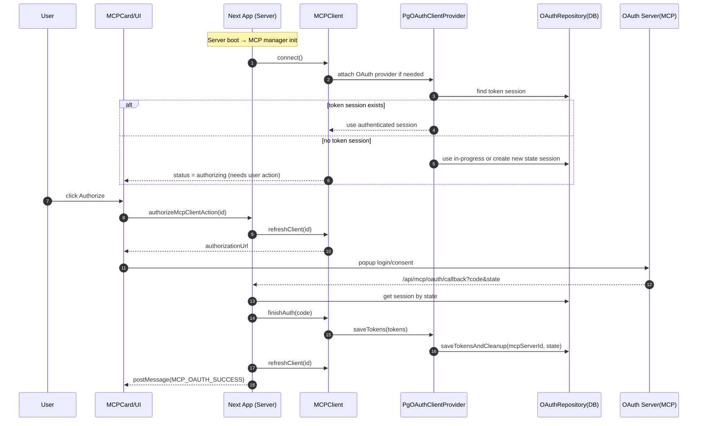

## 🔐 MCP OAuth Flow

The app acts as the OAuth client and stores OAuth sessions in PostgreSQL. On server startup, MCP clients attempt to connect. If authentication is required, the client enters the authorizing state and the UI prompts the user to authorize.

Notes:

- Multi‑instance safe: unique state per attempt; when tokens are saved, incomplete sessions for the same server are cleaned up.
- Security guard: redirect URI mismatch clears all sessions and restarts the flow.

