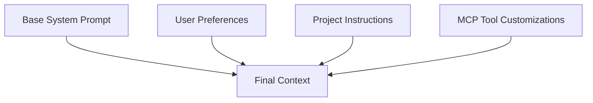

# 🎯 System Prompts & Chat Customization Guide

> Transform your chatbot experience with powerful system prompt customization. The better-chatbot uses a sophisticated multi-layered prompt system that adapts to your preferences, project context, and MCP tool usage — making every conversation more personalized and effective.

The system intelligently combines multiple prompt layers to create the perfect context for each chat, ensuring the assistant understands exactly how to help you.



<br/>

## 🔧 Accessing Chat Preferences

Click the **settings button** in the bottom-left corner to open the dropdown menu, then select **"Chat Preferences"** to customize how the assistant interacts with you.

### 👤 Personal Preferences

Configure three key aspects of your interaction:

**Assistant Name:** How you'd like the assistant to address you
- Example: "Alex", "Dr. Smith", "Team Lead"

**Your Role/Profession:** Your job or expertise area (helps the assistant tailor explanations)
- Example: "Software Engineer", "Marketing Manager", "Student"

**Response Style:** How you prefer the assistant to communicate
- Example: "Keep explanations brief and to the point"
- Example: "When learning new concepts, I find analogies particularly helpful"
- Example: "Ask clarifying questions before giving detailed answers"

<br/>

## ⚙️ Custom Instructions for MCP Tools

Access **"Custom Instructions"** to set up context that automatically applies when using MCP servers and tools.

### 🖥️ MCP Server Instructions

Set default context for entire MCP servers. Perfect for avoiding repetitive information:

**GitHub MCP Server Example:**
```
Default repository: owner/repo-name
Always use the main branch unless specified
Include issue labels when creating issues
```

**File System MCP Server Example:**
```
Working directory: /Users/username/projects/my-app
Prefer relative paths in responses
Always backup before making destructive changes
```

### 🔧 Individual Tool Instructions

Configure specific tools within MCP servers for even more precision:

**Google Login Tool Example:**
```
Default email: user@company.com
Prefer 2FA authentication when available
```

**Database Query Tool Example:**
```
Default database: production
Always explain query results in business terms
Include performance impact warnings for large queries
```

<br/>

## 🏗️ How the System Works

The chatbot combines four distinct prompt layers to create the perfect context:

1. **Base System Prompt** - Core better-chatbot behavior
2. **User Preferences** - Your personal settings and communication style  
3. **Project Instructions** - Context from the current project (if applicable)
4. **MCP Customizations** - Tool-specific instructions (only when tools are used)

This layered approach ensures:
- ✅ **Efficiency**: Only relevant context is included
- ✅ **Consistency**: Your preferences apply across all chats
- ✅ **Flexibility**: Different projects can have different contexts
- ✅ **Intelligence**: Tool instructions activate only when needed

<br/>

## 💡 Pro Tips

**Start Simple:** Begin with basic preferences, then add MCP customizations as you use specific tools regularly.

**Be Specific:** The more detailed your instructions, the better the assistant can help. Instead of "be helpful," try "explain technical concepts with real-world examples."

**Test & Iterate:** Use the tool testing feature to see how your customizations affect tool behavior before using them in important chats.

**Project Synergy:** Combine personal preferences with project-specific instructions for domain expertise (e.g., "React developer" + "E-commerce project context").

> 💡 **Result:** Every conversation becomes more productive because the assistant already understands your context, preferences, and workflow — no need to repeat yourself! 